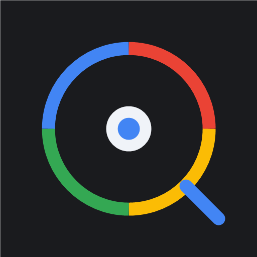

# Circle to Search - Raycast Extension

<p align="center">
  
</p>

<p align="center">
  <strong>Bring the seamless "Circle to Search" visual search experience to your desktop with Raycast.</strong>
</p>

<p align="center">
  <a href="https://www.raycast.com"></a>
  <a href="LICENSE"></a>
</p>

---

## 🌟 Overview

**Circle to Search** lets you freely circle, loop, or highlight any object on your screen to search it instantly using your favorite visual search engine (Google Lens, Bing Visual Search, Yandex Images, TinEye, or Baidu).

### Key Highlights:
- **⭕ Interactive Spotlight Cutout**: Dims the entire screen with a precision reticle cursor. As you draw around an object, the inside of your circle is dynamically illuminated in full brightness with a thin, crisp outline.
- **✂️ True Background-less Cutout**: Pixels outside your freehand drawing are clipped with 100% transparent alpha so the search engine focuses exclusively on what you circled.
- **🌐 Multi-Engine Support**: Switch seamlessly between Google Lens (default), Bing Visual Search, Yandex Images, TinEye, Baidu, or open all engines simultaneously.
- **⚡ Fast, Free & Ephemeral**: Zero API keys or paid accounts required. Uses resilient multi-host ephemeral image sharing with automatic failover.
- **📋 Clipboard & Full Screen Search**: Search images directly from your clipboard or capture the entire screen with dedicated commands.
- **💻 Cross-Platform**: Native interactive overlay on Windows and native interactive selection on macOS.

---

## 🚀 Commands

| Command | Description |
| :--- | :--- |
| **Circle Screen to Search** | Dims the screen with a precision reticle cursor, letting you freehand circle any area to search visually. |
| **Search Clipboard Image** | Instantly performs a visual search on whichever image or screenshot is currently in your clipboard. |
| **Search Full Screen** | Captures the entire display and launches visual search results in your default browser. |

---

## ⚙️ Configuration

In Raycast, go to **Settings** $\rightarrow$ **Extensions** $\rightarrow$ **Circle to Search** to configure your default visual search engine:

- **Google Lens** *(Default)*
- **Bing Visual Search**
- **Yandex Images**
- **TinEye Reverse Search**
- **Baidu Visual Search**
- **All Engines** *(Opens results in separate browser tabs simultaneously)*

---

## ⌨️ Recommended Hotkey Setup

For the fastest experience, assign a global hotkey to **Circle Screen to Search** in Raycast:

1. Open **Raycast Settings** (`Cmd + ,` or `Ctrl + ,`).
2. Go to the **Extensions** tab.
3. Search for **Circle to Search**.
4. Set a hotkey for **Circle Screen to Search** (e.g. `Ctrl + Shift + S` or `Cmd + Shift + S`).

Now you can circle and search anything on your screen with a single keystroke from any application!

---

## 🛠️ Development & Installation

### Local Development

```bash
# Clone the repository
git clone https://github.com/yetemgetaB/Circle-To-Search.git
cd Circle-To-Search

# Install dependencies
npm install

# Start development mode
npm run dev

# Build for production
npm run build
```

---

## 📄 License

This extension is licensed under the [MIT License](LICENSE).
